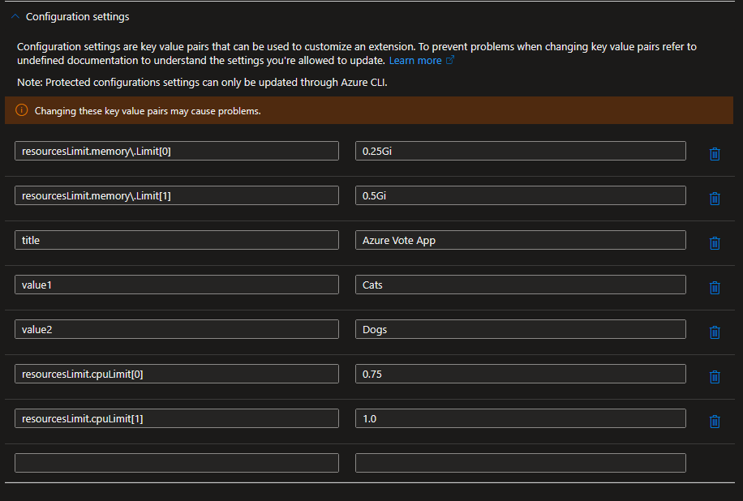

# Different data input sample for Kubernetes Marketplace Offer

This sample demonstrates how to override array objects inside helm chart for Kubernetes Marketplace Offer

In helm, there are 2 different ways to override array inside values.yaml
- --set cpuLimit='{1,1.5}'
- --set memoryLimit[0]=512Mi --set memoryLimit[1]=0.75Gi

Only the second way can be used in Kubernetes Marketplace Offer. In this sample, we will show 2 different way to achieve generating the key value pairs that can be used to override array inside values.yaml

This sample also shows how to override values with special characters like '.' and inside deeper nested objects.

## Editable grids

The following code snippet shows we want more flexiblity on the input, so we can use editable grid to generate the key value pairs that can be used to override array inside values.yaml

### UIDefinition.json
```json
{
    "name": "cpuLimit",
    "type": "Microsoft.Common.EditableGrid",
    "label": "CPU Limit",
    "ariaLabel": "Enter CPU Request and Limits in editable grid format",
    "constraints": {
        "width": "Full",
        "rows": {
            "count": {
                "min": 2,
                "max": 2
            }
        },
        "columns": [
            {
                "id": "cpuValue",
                "header": "CPU Value, first row is request, second row is limit",
                "width": "500px",
                "element": {
                    "type": "Microsoft.Common.TextBox",
                    "defaultValue": "0.25",
                    "toolTip": "This will replace the cpuLimit's array index values inside your values.yaml",
                    "constraints": {
                        "required": true,
                        "regex": "^[0-9]+.[0-9]+$",
                        "validationMessage": "Must be in the format for #.#"
                    }
                }
            }
        ]
    }
},
```

### ARM Template

```json
"copy": [
    {
        "count": "[length(parameters('app-cpuLimit'))]",
        "input": "[createObject(concat('resourcesLimit.cpuLimit[', copyIndex('cpuLimit_array'), ']'), union(createObject('value', ''), parameters('app-cpuLimit')[copyIndex('cpuLimit_array')]).cpuValue)]",
        "name": "cpuLimit_array"
    }
],
"cpuLimit_string": "[concat(string(variables('cpuLimit_array')), '_END_')]",
"cpuLimit_trim1": "[replace(variables('cpuLimit_string'), '[{\"', '{\"')]",
"cpuLimit_trim2": "[replace(variables('cpuLimit_trim1'), '}]_END_', '}')]",
"cpuLimit_trim3": "[replace(variables('cpuLimit_trim2'), '},{\"', ',\"')]",
"cpuLimit_json": "[json(variables('cpuLimit_trim3'))]",
```
With the above conversion, the following key value pairs will be generated:
```json
resourcesLimit.cpuLimit[0] = {"cpuValue":"0.25"}
resourcesLimit.cpuLimit[1] = {"cpuValue":"0.5"}
```
Which can then be passed into the configuration settings in the ARM template:


For more information about how this works, you can reference [dynamic-configuration-settings-sample](../dynamic-configuration-settings-sample/) sample.

## Textboxes

When we have static number of items you would like to include in the array, you can use textboxes to generate the key value pairs that can be used to override array inside values.yaml

### UI Definition
```json
{
    "name": "memoryLimit0",
    "type": "Microsoft.Common.TextBox",
    "label": "Memory Request",
    "toolTip": "This will replace the memoryLimit's array index 0 value inside your values.yaml",
    "defaultValue": "0.25Gi",
    "constraints": {
        "required": true,
        "regex": "^[0-9.]+[EPTGMK]i$",
        "validationMessage": "Must be in the format for #.#[EPTGMK]i"
    }
},
{
    "name": "memoryLimit1",
    "type": "Microsoft.Common.TextBox",
    "label": "Memory Limit",
    "toolTip": "This will replace the memoryLimit's array index 1 value inside your values.yaml",
    "defaultValue": "0.5Gi",
    "constraints": {
        "required": true,
        "regex": "^[0-9.]+[EPTGMK]i$",
        "validationMessage": "Must be in the format for #.#[EPTGMK]i"
    }
}
```

### ARM Template

In this sample, since memory limit is in the format of memory.limit, we need to escape the . with \\. so that it is still a valid JSON object while helm chart would still treat it is as 1 key.
```json
"otherConfigurationSettings": {
    "title": "[parameters('app-title')]",
    "value1": "[parameters('app-value1')]",
    "value2": "[parameters('app-value2')]",
    "resourcesLimit.memory\\.Limit[0]": "[parameters('app-memoryLimit0')]",
    "resourcesLimit.memory\\.Limit[1]": "[parameters('app-memoryLimit1')]"
},
"configurationSettings": "[union(variables('otherConfigurationSettings'), variables('cpuLimit_json'))]"
```

## Helm chart

To have azure-vote to consume the changes made in this sample, the following code snippet shows how the values are used in the helm chart:

deployments.yaml
```yaml
requests:
cpu: {{ index .Values.resourcesLimit.cpuLimit 0}}
memory: {{ index .Values "resourcesLimit" "memory.Limit" 0}}
limits:
cpu: {{ index .Values.resourcesLimit.cpuLimit 1}}
memory: {{ index .Values "resourcesLimit" "memory.Limit" 1}}
```

values.yaml
```yaml
resourcesLimit:
  # CPU request and limit array
  cpuLimit:
    - 0.25
    - 0.5
  # Memory request and limit array
  memory.Limit:
    - 128Mi
    - 256Mi
```

## Deployment result in Azure Portal Kubernetes Extensions page



## Note
This sample includes only a small subset of the files. The files in this sample folder contains the additional changes required on top of the base sample application '[k8s-offer-azure-vote](../k8s-offer-azure-vote/)'.