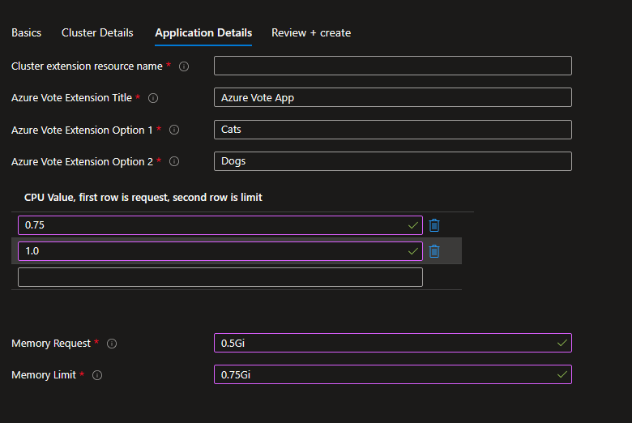

# Different data input sample for Kubernetes Marketplace Offer

This sample demonstrates 
- how to override array objects inside helm chart for Kubernetes Marketplace Offer
- how to override values on keys with special characters like '.' and inside deeper nested objects.

## Helm chart

To have azure-vote to consume the changes made in this sample, the following code snippet was added to values.yaml to allow user to override the CPU/Memory request and limit for the application.

### values.yaml
```yaml
resourcesLimit:
  # CPU request and limit array
  cpuLimit:
    - 0.25
    - 0.5
  # Memory request and limit array
  memory.Limit:
    - 128Mi
    - 256Mi
```

Both CPU/Memory request and limit is nested under resourcesLimit. CPU request and limit is an array, while memory request and limit is also an array but with special character '.' in the key name.

To consume these values properly from values.yaml, the following code snippet was added to deployments.yaml

### deployments.yaml
```yaml
requests:
cpu: {{ index .Values.resourcesLimit.cpuLimit 0}}
memory: {{ index .Values "resourcesLimit" "memory.Limit" 0}}
limits:
cpu: {{ index .Values.resourcesLimit.cpuLimit 1}}
memory: {{ index .Values "resourcesLimit" "memory.Limit" 1}}
```
In normal array, we can use index to access the value in the array. However, since memory.Limit has special character '.', we need to use index .Values "resourcesLimit" "memory.Limit" to access the value in the array.

## How helm chart values are passed in through ARM template

In helm, there are 2 different ways to override array inside values.yaml
- --set resourcesLimit.cpuLimit='{1,1.5}'
- --set resourcesLimit.cpuLimit[0]=1 --set resourcesLimit.cpuLimit[1]=1.5

Only the second way can be used in Kubernetes Marketplace Offer. In this sample, we will show 2 different way to achieve generating the key value pairs that can be used to override array inside values.yaml

## Textboxes

When we have static number of items you would like to include in the array, you can use textboxes to generate the key value pairs that can be used to override array inside values.yaml

### UI Definition
```json
{
    "name": "memoryLimit0",
    "type": "Microsoft.Common.TextBox",
    "label": "Memory Request",
    "toolTip": "This will replace the memoryLimit's array index 0 value inside your values.yaml",
    "defaultValue": "0.25Gi",
    "constraints": {
        "required": true,
        "regex": "^[0-9.]+[EPTGMK]i$",
        "validationMessage": "Must be in the format for #.#[EPTGMK]i"
    }
},
{
    "name": "memoryLimit1",
    "type": "Microsoft.Common.TextBox",
    "label": "Memory Limit",
    "toolTip": "This will replace the memoryLimit's array index 1 value inside your values.yaml",
    "defaultValue": "0.5Gi",
    "constraints": {
        "required": true,
        "regex": "^[0-9.]+[EPTGMK]i$",
        "validationMessage": "Must be in the format for #.#[EPTGMK]i"
    }
}
```

### ARM Template

Since memory limit is in the format of memory.limit, helm would need the following to overwrite the values in values.yaml

``` 
--set resourcesLimit.memory\.limit[0]=1 --set resourcesLimit.memory\.limit[1]=1.5
```

From ARM template, we need to escape the \ with \\\\ so that it is still a valid JSON object. So the final key value pairs would be:
```
"resourcesLimit.memory\\.Limit[0]": "[parameters('app-memoryLimit0')]",
"resourcesLimit.memory\\.Limit[1]": "[parameters('app-memoryLimit1')]"
```


## Editable grids

When we want more flexiblity on the inputs, we can use editable grid to generate the key value pairs.

### UIDefinition.json
```json
{
    "name": "cpuLimit",
    "type": "Microsoft.Common.EditableGrid",
    "label": "CPU Limit",
    "ariaLabel": "Enter CPU Request and Limits in editable grid format",
    "constraints": {
        "width": "Full",
        "rows": {
            "count": {
                "min": 2,
                "max": 2
            }
        },
        "columns": [
            {
                "id": "cpuValue",
                "header": "CPU Value, first row is request, second row is limit",
                "width": "500px",
                "element": {
                    "type": "Microsoft.Common.TextBox",
                    "defaultValue": "0.25",
                    "toolTip": "This will replace the cpuLimit's array index values inside your values.yaml",
                    "constraints": {
                        "required": true,
                        "regex": "^[0-9]+.[0-9]+$",
                        "validationMessage": "Must be in the format for #.#"
                    }
                }
            }
        ]
    }
},
```

### ARM Template

```json
"copy": [
    {
        "count": "[length(parameters('app-cpuLimit'))]",
        "input": "[createObject(concat('resourcesLimit.cpuLimit[', copyIndex('cpuLimit_array'), ']'), union(createObject('value', ''), parameters('app-cpuLimit')[copyIndex('cpuLimit_array')]).cpuValue)]",
        "name": "cpuLimit_array"
    }
],
"cpuLimit_string": "[concat(string(variables('cpuLimit_array')), '_END_')]",
"cpuLimit_trim1": "[replace(variables('cpuLimit_string'), '[{\"', '{\"')]",
"cpuLimit_trim2": "[replace(variables('cpuLimit_trim1'), '}]_END_', '}')]",
"cpuLimit_trim3": "[replace(variables('cpuLimit_trim2'), '},{\"', ',\"')]",
"cpuLimit_json": "[json(variables('cpuLimit_trim3'))]",
```
With the above conversion, the following key value pairs will be generated:
```
resourcesLimit.cpuLimit[0] = {"cpuValue":"0.25"}
resourcesLimit.cpuLimit[1] = {"cpuValue":"0.5"}
```
Which can then be passed into the configuration settings in the ARM template:


For more information about how this works, you can reference [dynamic-configuration-settings-sample](../dynamic-configuration-settings-sample/) sample.

## Resulting UI definition in Azure Portal Kubernetes Extensions page



## Deployment result in Azure Portal Kubernetes Extensions page


## Note
This sample includes only a small subset of the files. The files in this sample folder contains the additional changes required on top of the base sample application '[k8s-offer-azure-vote](../k8s-offer-azure-vote/)'.