# Dynamic configuration settings sample

This folder contains samples that shows how ISV can combinee dynamic and mandatory settings in UIDefinition and consume them in ARM Template so that they can be passed to Kubernetes Extension Type as Configuration Settings.

## The resulting UI Definition will shows up as follow:

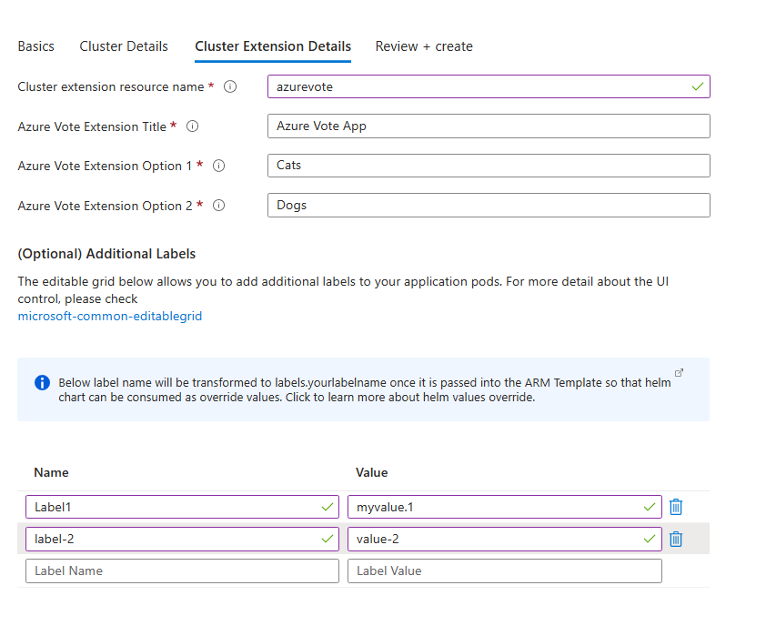

## Resulting Pod Label

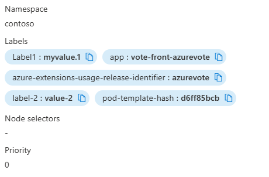

## Configuration Settings

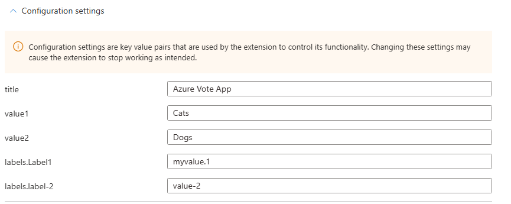

# Explanation

## Helm chart

For Azure-vote to take labels setting to the pods, the following changes are required:

### deployments.yaml

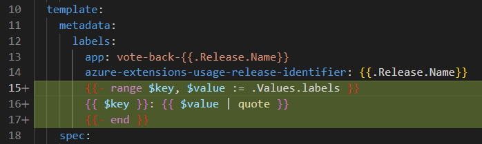

### values.yaml

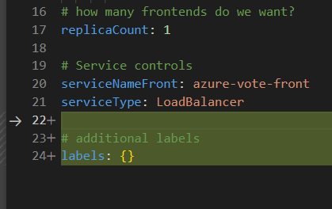

## UIDefinition
The following section creates an array of key value pairs
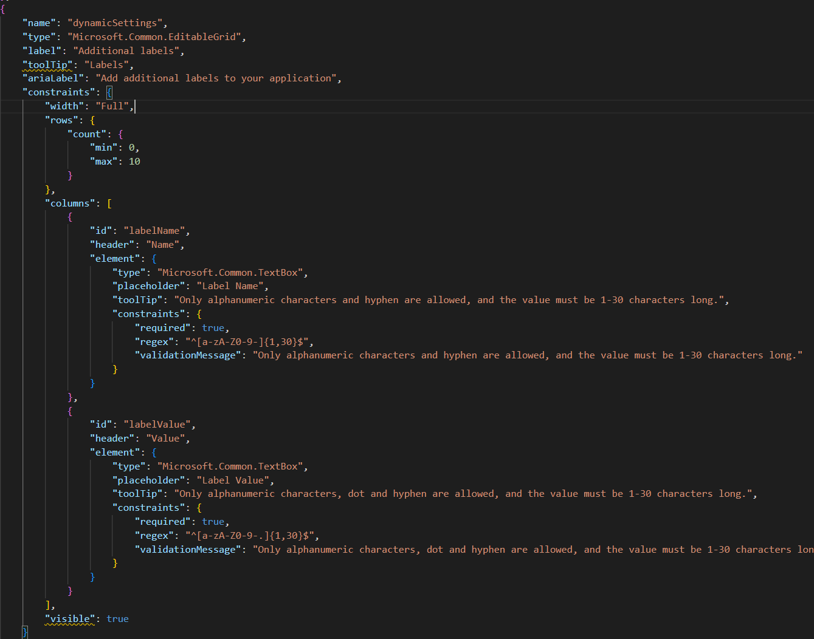

Which will generate the following output based on above example:
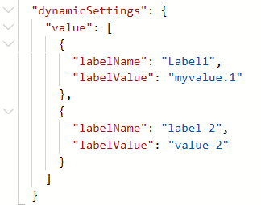

## ARM Template
A few variables are required to use to construct the final configuration settings that can be consumed by k8s extension type

- Convert dynamic settings array to json
 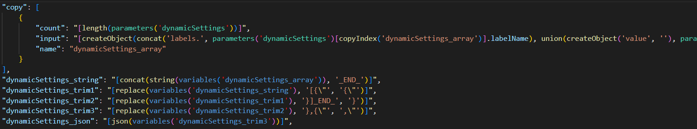

- Check if dynamic settings is not set, so we don't need to combine the values with mandatory settings
 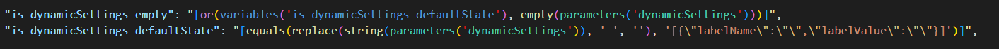

- Combine mandatory values as json          
 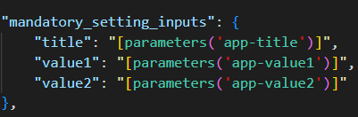

- Union mandatory values and dynamic settings if it is set as json
 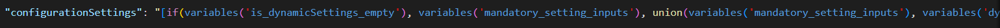

# Note
Please note this sample includes only a small subset of the files. The files in this sample folder contains the additional changes required on top of the base sample application '[k8s-offer-azure-vote](../k8s-offer-azure-vote/)'.