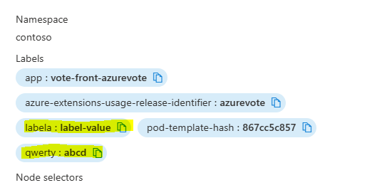

# Dynamic Label example

This folder contains samples that shows how ISV can create dynamic list and static settings in UIDefinition and consume them in ARM Template so that they can be passed to Kubernetes Extension Type as Configuration Settings.

The resulting UI Definition will shows up as follow:

Resulting Pod

