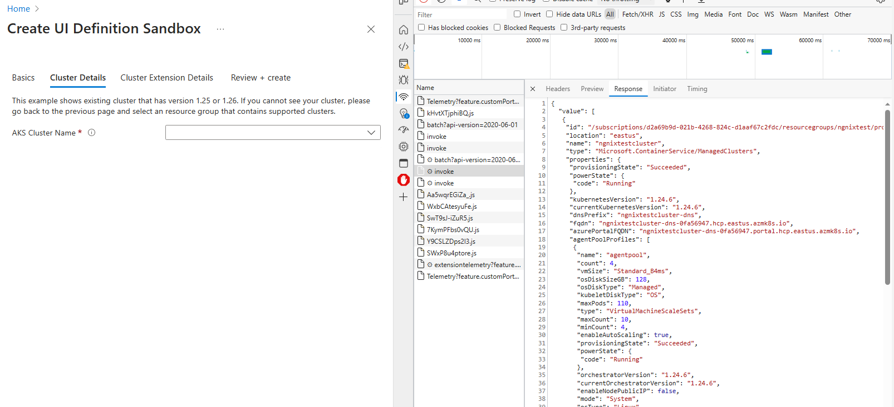

# Conditional Kubernetes Cluster sample

This folder contains samples that shows how ISV can create or select existing Kubernetes cluster with specific k8s version in Azure Marketplace. Same idea can be applied to filter other cluster properties like size, node count, etc.

## How it works

### Existing cluster
```
{
    "name": "existingClusterResourceName",
    "type": "Microsoft.Common.DropDown",
    "label": "AKS Cluster Name",
    "toolTip": "Existing AKS Cluster Resource Name",
    "constraints": {
        "allowedValues": "[map(filter(steps('clusterDetails').existingClusterSection.clusterLookupControl.value, (i) =>  contains(parse('[\"25\", \"26\"]'), last(take(split(i.properties.kubernetesVersion, '.'), 2))) ), (l) => parse(concat('{\"label\":\"', l.name, '\",\"value\":\"', l.name, '\"}')))]",
        "required": true
    }
}
```    

This part ``(steps('clusterDetails').existingClusterSection.clusterLookupControl.value, (i) =>  contains(parse('[\"25\", \"26\"]'), last(take(split(i.properties.kubernetesVersion, '.'), 2))) )`` is responsible for filtering existing clusters by k8s version. In this case we are filtering clusters with k8s version 1.25.x and 1.26.x. In order to compare the minor version and ignoring the patch, we are splitting the k8s version by '.' and taking the last 2 elements of the array. Then we are checking if the last 2 elements are in the list of allowed versions. If yes, we are returning the cluster name and version as a JSON object.

To find out what properties you can filter on, you can use [UI definition sandbox](https://portal.azure.com/?feature.customPortal=false#view/Microsoft_Azure_CreateUIDef/SandboxBlade) and F12 developer tools to inspect the JSON object returned by the API.



### Create new cluster
```
{
    "name": "kubernetesVersion",
    "type": "Microsoft.Common.DropDown",
    "label": "Kubernetes version",
    "toolTip": "The version of Kubernetes that should be used for this cluster. You will be able to upgrade this version after creating the cluster.",
    "constraints": {
        "allowedValues": "[map(filter(steps('clusterDetails').newClusterSection.aksVersionLookupControl.properties.orchestrators, (i) =>  contains(parse('[\"25\", \"26\"]'), last(take(split(i.orchestratorVersion, '.'), 2))) ), (l) => parse(concat('{\"label\":\"', l.orchestratorVersion, '\",\"value\":\"', l.orchestratorVersion, '\"}')))]",
        "required": true
    }
},
```

Same idea as above, but this time we are filtering the list of available k8s versions for new cluster.

## Additional resources
For more detail on how to control the conditional visibility of the UI elements, please refer to the [documentation](https://learn.microsoft.com/en-us/azure/azure-resource-manager/managed-applications/create-uidefinition-functions).

## Note
This sample includes only a small subset of the files. The files in this sample folder contains the additional changes required on top of the base sample application '[k8s-offer-azure-vote](../k8s-offer-azure-vote/)'.