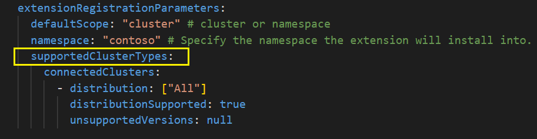
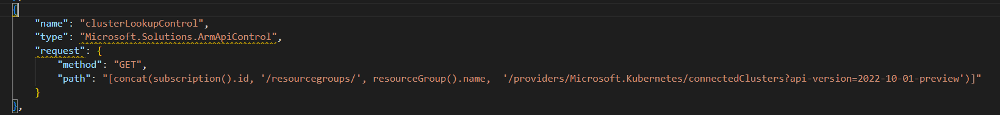
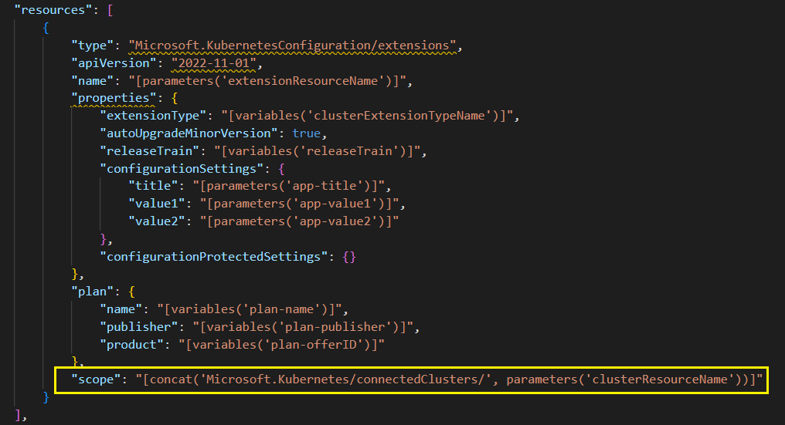
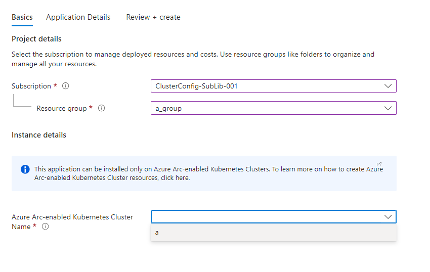
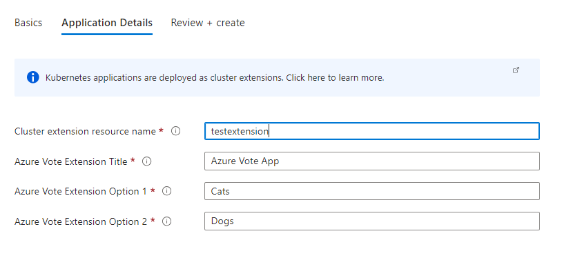

# ConnectedCluster-only sample

This folder contains samples that show how an ISV can prepare a Kubernetes application that can be installed only on Azure Arc-enabled Kubernetes Clusters.

Note:
  - Throughout this sample, the terms  "connectedClusters" and "connected clusters" denote Azure Arc-enabled Kubernetes clusters.

## Artifact changes

The following changes are required to enable support for connected clusters.

### Manifest

Add 'supportedClusterTypes' under extensionRegistrationParameters.

Sample below indicates all ditributions of connectedCluster type are supported with no restriction on any versions.




Following is the guidance on the supportedClusterTypes:

| Property      | Description |
| -----------   | ----------- |
| supportedClusterTypes       | Contains an object for each top-level cluster-type. Allowed types are – “managedClusters”, “connectedClusters”. "managedClusters" denotes Azure Kubernetes Service (AKS) clusters. "connectedClusters" denotes Azure Arc-enabled Kubernetes clusters. For each of these cluster types, specify distributions and unsupported Kubernetes versions for these distributions. If supportedClusterTypes is not provided, all distributions of ‘managedClusters’ will be supported by default. If supportedClusterTypes is provided, and a given top level cluster type is not provided, then all distributions and Kubernetes versions for that cluster type will be treated as unsupported. |
| distribution   | An array of distributions  corresponding to the cluster type. Provide name(s) of specific distributions. Set the value to [“All”]  to indicate all distributions are supported. |
| distributionSupported  | A boolean value representing whether the specified distribution(s) are supported. If false, providing a value for UnsupportedVersions will cause an error. |
| unsupportedVersions  | A list of versions for the specified distribution(s) which are unsupported. Supported operators are decribed below:: |

                        •	"=" Given version is not supported. E.g.: “=1.2.12”

                        •	">" All versions greater than the given version are not supported. E.g.: “>1.1.13”

                        •	"<" All versions less than the given version are not supported. E.g.: “<1.3.14”

                        •	"..." All versions in range are unsupported. E.g.: ” 1.1.2...1.1.15”  (includes right-side value and excludes left-side value)

#### More samples of supportedClusterTypes:

Only the "AKS" ditribution is supported with no restriction on versions
``` yaml
  supportedClusterTypes:
    connectedClusters:
      - distribution: ["AKS"]
        distributionSupported: true
        unsupportedVersions: null
```

Only the "AKS" distribution is supported with restrictions on some versions
``` yaml
  supportedClusterTypes:
    connectedClusters:
      - distribution: ["AKS"]
        distributionSupported: true
        unsupportedVersions: ["1.10.0...1.20.0", ">1.22.1"]
```

Only the "AKS" and "GKE" distributions are supported with restriction on some versions
``` yaml
  supportedClusterTypes:
    connectedClusters:
      - distribution: ["AKS"]
        distributionSupported: true
        unsupportedVersions: ["=1.2.0"]
      - distribution: ["GKE"]
        distributionSupported: true
        unsupportedVersions: ["1.10.0...1.20.0", ">1.22.1"]
```
### CreateUIDefinition

Following are the important changes to be made in the CreateUIDefinition file. For a complete list of all changes and UI elements, please refer the CreateUIDefinition.json in the sample folder.

Add a cluster lookup ArmApiControl that fetches a list of the Azure Arc-enabled Kubernetes Clusters (connected clusters) from the selected subscription and resource group.




### ARM Template

Following are the important changes to be made in the ARM template file. For a complete list of all changes, please refer the mainTemplate.json in the sample folder.

The ARM template does not need to create a new cluster resource. The user can deploy the extension only on an existing connected cluster.

Add the extension resource under 'resources' section of the template. Note the 'scope' of the extension resource refers to the connected cluster resource.



## End-user experience when creating the extension

The resulting UI Definition will shows up as follows when the end-user creates an extension using Azure Portal:

### Selecting an existing connected cluster:



### Configuring application:



## Note
This sample includes only a small subset of the files. The files in this sample folder contains the additional changes required on top of the base sample application '[k8s-offer-azure-vote](../k8s-offer-azure-vote/)'.