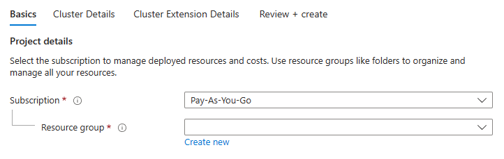
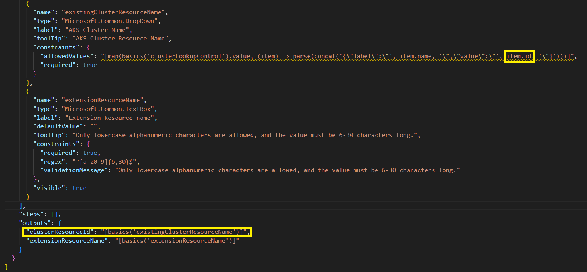
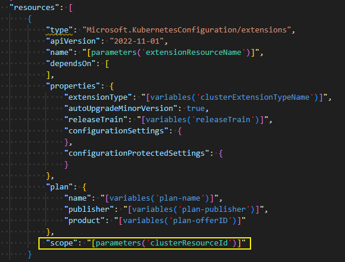

# Existing cluster only sample

This sample illustrates how ISV can allow an application to deploy only on existing clusters. The CreateUIDefinition and ARM template files in this folder show how to use only existing cluster option.

## The resulting UI Definition will show up as follows:

# Explanation

## UIDefinition
For setting the scope to the existing cluster, create ui definition should store id of the existing cluster in output variable as follows

## ARM Template
Scope for extension resource should be set using the cluster resource id as follows

 

## Note
This sample includes only a small subset of the files. The files in this sample folder contains the additional changes required on top of the base sample application '[k8s-offer-azure-vote](../k8s-offer-azure-vote/)'.