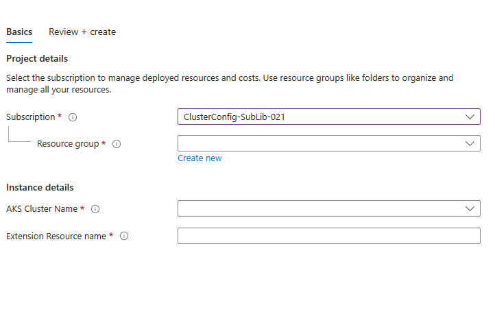

# Existing cluster only sample

This folder contains samples that shows how ISV can use only existing cluster option in their create ui definition.

## The resulting UI Definition will show up as follows:

# Explanation

For setting the scope to the existing cluster, create ui definition should store id of the existing cluster in output variable as follows

## UIDefinition
The following section creates an array of key value pairs

## ARM Template
Scope for extension resource should be set using the cluster resource id as follows

 

## Note
This sample includes only a small subset of the files. The files in this sample folder contains the additional changes required on top of the base sample application '[k8s-offer-azure-vote](../k8s-offer-azure-vote/)'.