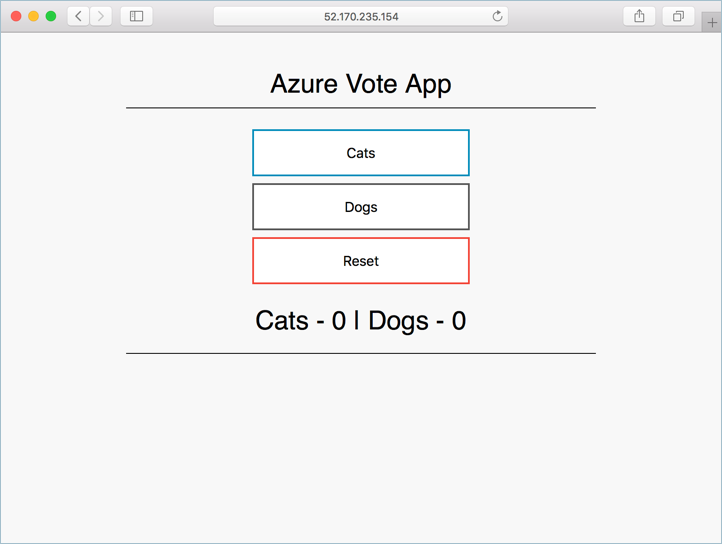
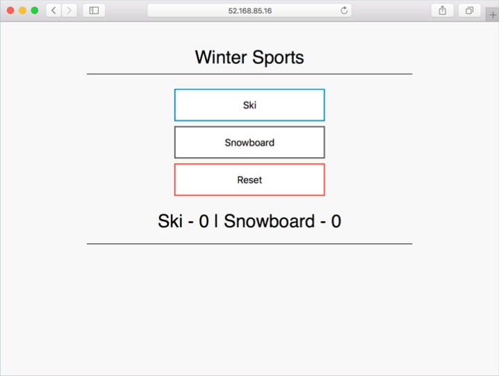

# azure-vote-custom

The Azure Vote Custom application is a simple sample to demonstrate custom meters usage in a containerized app. The application consists of two pods, one running a flask web form, and the second a redis instance for temporary data storage. This application can be used as a sample app for custom meters based offers on Azure marketplace.

## Installing the Chart

Add the Azure Samples chart repository.

```
helm repo add azure-samples https://azure-samples.github.io/helm-charts/
```

Install the chart.

```
helm install azure-samples/azure-vote-custom
```


## Configuration

The following tables lists the configurable parameters of the azure-vote chart and the default values.

| Parameter | Description | Default |
|---|---|---|
| title | Azure vote app title. | Azure Vote App |
| value1 | Value for first vote control / value | Cats |
| value2 | Value for second vote control / value | Dogs |
| serviceName | Name for Kubernetes service. | aks-helloworld |
| serviceType | Type for Kubernetes service. | ClusterIP |

## Examples

```
helm install azure-samples/azure-vote-custom
```



```
helm install azure-samples/azure-vote --set title="Winter Sports" --set value1=Ski --set value2=Snowboard
```




