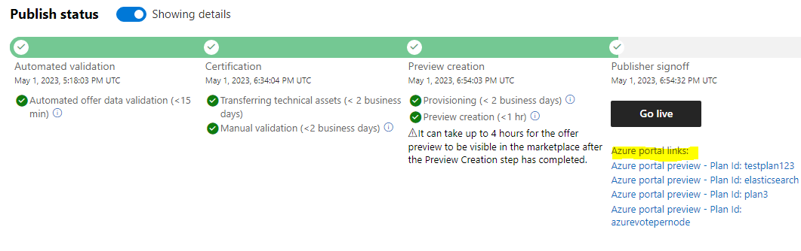

# Managed App Sample

This folder contains samples that shows how ISV can create a managed application that can be published to Azure Marketplace leveraging kubernetes extension type.

## Limitations

The managed app offer won't work against an existing cluster. The offer needs to create a new cluster and install the application on the cluster, otherwise, the offer will fail to deploy.


## Prerequisites

First you will need to setup an kubernetes offering in Azure Marketplace that you would like to reference in your managed app offer. You can reference to the Getting Started guide [here](../../getting-started/GettingStarted.md) to create a kubernetes offering.

Your UI definition and ARM template in this offer can be really simple as you will be extending that in your managed app offer.

In this example, we will start from [k8s-offer-azure-vote](../k8s-offer-azure-vote/) folder to create the CNAB bundle for the base kubernetes offering.

Once you have your offer published and is available in Azure Marketplace in preview stage, you can start creating your managed app offer.



## Create a managed app offer

First, you will start with the [mainTemplate](./mainTemplate.json) and [createUIDefinition](./createUIDefinition.json) files in this folder. First, we would need to update the variables section:

```json
"variables": {
    "plan-name": "DONOTMODIFY",
    "plan-publisher": "DONOTMODIFY",
    "plan-offerID": "DONOTMODIFY",
    "releaseTrain": "DONOTMODIFY",
    "clusterExtensionTypeName": "DONOTMODIFY"
},
```
To retrieve the value directly from the kubernetes offering, you can follow this [guide](https://learn.microsoft.com/en-us/azure/aks/deploy-application-template#generate-arm-template)


## Preparing mainTemplate.json

In this sample [mainTemplate](./mainTemplate.json), we have added extra components to demostrate how to add additional components to the managed app offer. 

- User Assigned identity:

```json
{
    "type": "Microsoft.ManagedIdentity/userAssignedIdentities",
    "name": "[concat(parameters('clusterResourceName'), '-identity')]",
    "apiVersion": "2023-01-31",
    "location": "[resourceGroup().location]"
},
```

- Keyvault, access policy and secret:

```json
{
    "name": "[uniqueString(resourceGroup().id, resourceGroup().location, 'keyvault')]",
    "type": "Microsoft.KeyVault/vaults",
    "apiVersion": "2019-09-01",
    "location": "[resourceGroup().location]",
    "tags": {
        "displayName": "keyVault1"
    },
    "properties": {
        "enabledForDeployment": true,
        "enabledForTemplateDeployment": true,
        "enabledForDiskEncryption": true,
        "tenantId": "[subscription().tenantId]",
        "accessPolicies": [
            {
                "tenantId": "[subscription().tenantId]",
                "objectId": "[reference(resourceId('Microsoft.ManagedIdentity/userAssignedIdentities', concat(parameters('clusterResourceName'), '-identity')), '2023-01-31').principalId]",
                "permissions": {
                    "keys": [
                        "Get"
                    ],
                    "secrets": [
                        "List",
                        "Get",
                        "Set"
                    ]
                }
            }
        ],
        "sku": {
            "name": "standard",
            "family": "A"
        }
    },
    "resources": [
        {
            "type": "secrets",
            "name": "secretExample1",
            "apiVersion": "2016-10-01",
            "dependsOn": [
                "[resourceId('Microsoft.KeyVault/vaults', uniqueString(resourceGroup().id, resourceGroup().location, 'keyvault'))]"
            ],
            "properties": {
                "value": "secretValue"
            }
        }
    ],
    "dependsOn": [
        "[resourceId('Microsoft.ManagedIdentity/userAssignedIdentities', concat(parameters('clusterResourceName'), '-identity'))]"
    ]
}
```

- Assigning the identity to the cluster's node and depends on:

```json
"type": "Microsoft.ContainerService/managedClusters",
"apiVersion": "2022-11-01",
"name": "[parameters('clusterResourceName')]",
"location": "[parameters('location')]",
"dependsOn": [
    "[resourceId('Microsoft.ManagedIdentity/userAssignedIdentities', concat(parameters('clusterResourceName'), '-identity'))]"
],
"tags": {},
"sku": {
    "name": "Basic",
    "tier": "Free"
},
"identity": {
    "type": "UserAssigned",
    "userAssignedIdentities": {
        "[resourceId('Microsoft.ManagedIdentity/userAssignedIdentities', concat(parameters('clusterResourceName'), '-identity'))]": {}
    }

},
```

## UIDefinition

In this sample [createUiDefinition](./createUiDefinition.json), we have remove extra components that is not applicable for the managed app offer.

## Package the files

Zip the 2 files mainTemplate.json and createUiDefinition.json into a zip file. 

## Create the managed app offer

Now that you have the artifacts required, you can follow this [guide](https://learn.microsoft.com/en-us/partner-center/marketplace/azure-app-offer-setup) to create the managed app offer.

