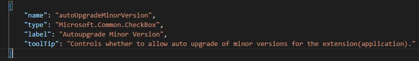
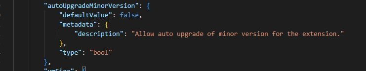
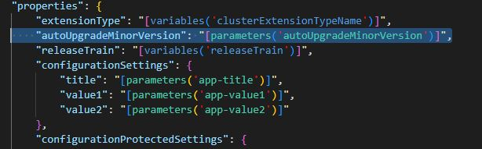

# Azure Marketplace Kubernetes App- Autoupgrade as parameter changes

Automatic Extension Upgrade is available for Marketplace Kubernetes applications (extensions) for minor and patch version upgrades.
When 'autoUpgradeMinorVersion' setting is enabled, the application is upgraded automatically whenever the application publisher releases a new minor or patch version for that application.
This sample illustrates changes required to provide auto upgrade of minor version as a choice to the end user at deployment time.

It involves the following changes in createUIDefinition.json and maintemplate.json

    1) Take Autoupgrade Minor version choice as an input in the CreateUIDef file- createUIDefinition.json.-so autoUpgradeMinorVersion is added as a checkbox, the value of which can be true or false. 

    2) Pass the value provided for "autoUpgradeMinorVersion" in the CreateUIDef to the Extension resource in the ARM template. Extension resource property -autoUpgradeMinorVersion is being updated as parameter in the ARM template file- maintemplate.json.

3) here the parameter is being used as resource input

Please note this sample includes only a small subset of the files. The files in this sample folder contains the additional changes required on top of the base sample application [k8s-offer-azure-vote app](https://github.com/Azure-Samples/kubernetes-offer-samples/tree/main/samples/k8s-offer-azure-vote).
