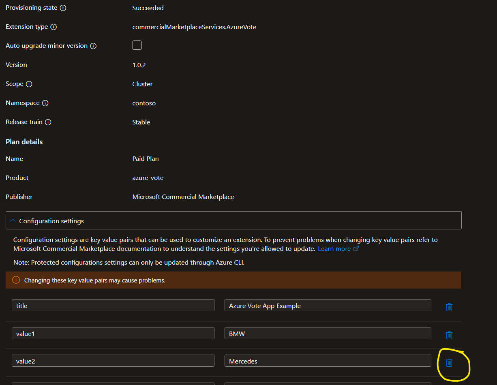

# Azure Kubernetes Service (AKS) Terraform sample

This sample provides a Terraform configuration to deploy kubernetes application azure-vote on Azure Kubernetes Service (AKS).

## Prerequisites

- [Terraform](https://www.terraform.io/downloads.html)
- [Azure CLI](https://docs.microsoft.com/en-us/cli/azure/install-azure-cli)


## Prepare the environment

- Initialize Terraform in the current directory by running the following command:

  ```bash
  terraform init
  ```

- There are 2 example tfvars files in the current directory. You can use them to deploy the application with different configurations.

  - `azure-vote-without-config.tfvars` - Deploy the application with default configuration for azure-vote.
  - `azure-vote-with-config.tfvars` - Deploy/update the application with custom configuration for azure-vote.

- Before you test run the sample tfvars files, you need to update the followings in the tfvars files:

  - `cluster_name` - The name of the AKS cluster.
  - `resource_group_name` - The name of the resource group where AKS cluster is located.
  - `subscription_id` - The subscription ID where AKS cluster is located.


## Deploy the application

- Deploy the application with default configuration for azure-vote.

  ```bash
  terraform apply -var-file="azure-vote-without-config.tfvars"
  ```


- Deploy/update the application with custom configuration for azure-vote.

  ```bash
    terraform apply -var-file="azure-vote-with-config.tfvars"
    ```

## Clean up the resources

- To clean up the resources, run the following command to delete the azure-vote application from your AKS cluster:

  ```bash
  terraform destroy -var-file="azure-vote-without-config.tfvars"
  ```

  or

  ```bash
  terraform destroy -var-file="azure-vote-with-config.tfvars"
  ```


## Limitations

- Once you have deployed the application with configurations settings, you cannot use terraform to delete 1 of the existing configurations. You can instead use Azure portal (under Kubernetes service ->Extensions + applications) to remove the particular configuration settings.

